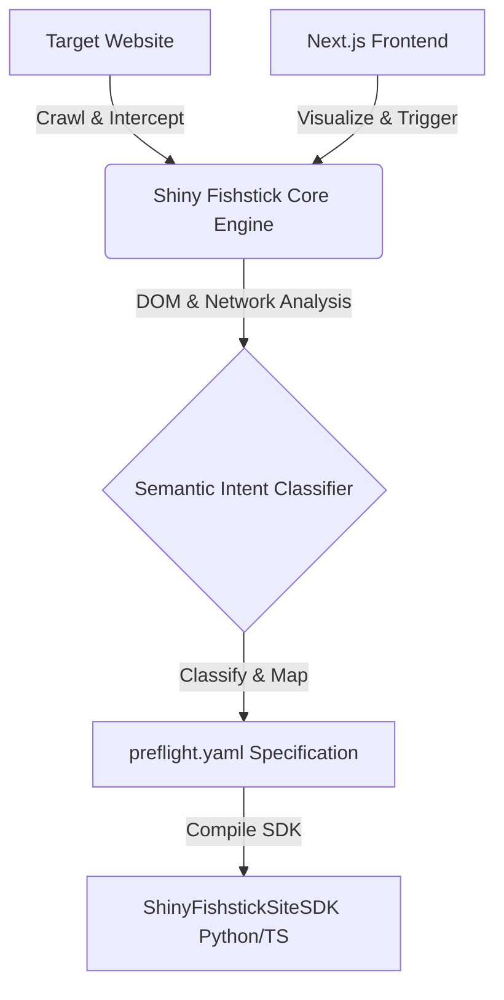

# 🐟 Shiny Fishstick

> **The Navigation Layer for AI Browser Agents.**  
> *Because agents shouldn't have to parse raw HTML, guess CSS selectors, or deal with login redirects just to add a product to a cart.*

---

## 📖 The Story of the Shiny Fishstick

Every AI browser agent begins its journey with a simple goal: *"Buy a pair of red running shoes."* 

But as the agent descends into the raw DOM of modern web applications, the dream quickly turns into a nightmare. It encounters nested shadow DOMs, randomized Tailwind class names (`class="flex items-center justify-between p-4 md:p-6 bg-slate-900/40 border-b border-slate-800/60"`), dynamically injected popups, and complex, redirect-heavy authentication flows. To click a button, the agent must pay a heavy tax in context window size, sending raw screenshots and megabytes of HTML source back and forth to an LLM. And if a developer changes `#btn-add-to-cart` to `#add-to-cart-btn` next Tuesday? The agent crashes.

**Shiny Fishstick** is the compiler that changes this paradigm. 

Instead of forcing browser agents to navigate raw web pages ad-hoc, Shiny Fishstick pre-compiles any website into a structured, semantic action layer: **OpenAPI but for human-centric websites**. 

When you run Shiny Fishstick on a target site, it executes a complete discovery pipeline:
1. **The Crawler** performs a fast, BFS-based traversal, resolving login redirects and session configurations.
2. **The Analyzer** extracts all forms, interactive elements, and input selectors, generating robust selectors using heuristic scoring.
3. **The Intent Classifier** categories interactive elements into semantic actions (like `login`, `search_products`, `add_to_cart`, `checkout`).
4. **The API Discovery Engine** intercepts background network requests (XHR/Fetch) and automatically upgrades UI actions into high-speed API requests where possible.
5. **The Workflow Discovery Engine** models consecutive action transitions as a Finite State Machine (FSM).

The compiler spits out a clean `preflight.yaml` spec and native SDK code (Python/TypeScript):

```python
# The agent's new reality:
site = ShinyFishstickSiteSDK("http://my-shop.com")
site.start()
site.login(email="agent@gemini.com", password="secure123")
site.search_products(q="running shoes")
site.add_to_cart(product_id="42", quantity=1) # Executes directly as a REST call!
site.checkout()
```

Instead of expensive DOM scraping, AI agents can now interact with web platforms with the speed, stability, and structure of a native REST API.

---

## ⚡ Core Features

- 🔍 **Redirect-Aware BFS Crawler**: Gracefully handles login redirection and maps authorized session states.
- 🏷️ **Dynamic Heuristic DOM Analyzer**: Ranks CSS selectors to ensure stable target selection (`data-testid` > `id` > `name` > `class` > `xpath`).
- 🤖 **Semantic Intent Extraction**: Categorizes UI input targets into high-level agent parameters.
- 🔌 **XHR Interception & API Upgrades**: Captures background fetches to replace slow browser UI clicks with direct API requests.
- 📈 **Workflow FSM Discovery**: Automatically discovers sequential dependencies (e.g. `login` -> `search` -> `add_to_cart` -> `checkout`).
- 🖥️ **Stunning Visual Dashboard**: A beautiful, premium dark-mode Next.js application to monitor crawls, inspect actions, view FSM graphs, and download generated SDKs.

---

## 📐 Quick Architecture Overview

Shiny Fishstick is organized into three clean layers:



*For a detailed look at the codebase components, check out [ARCHITECTURE.md](file:///Users/adityadixit/Documents/Code/Preflight%20Designer/architecture.md).*

---

## 🚀 Getting Started

### Prerequisites
- Python 3.9+
- Node.js 18+
- Playwright dependencies (`playwright install`)

### 📦 1. Installation

Clone the repository and set up the backend virtual environment:
```bash
git clone git@github.com:Hootsworth/shiny-fishstick.git
cd shiny-fishstick
python3 -m venv backend/venv
source backend/venv/bin/activate
pip install -r backend/requirements.txt
playwright install chromium
```

Install frontend dependencies:
```bash
cd frontend
npm install
cd ..
```

---

### 🧪 2. Run the Verification Pipeline

To execute a complete test compile run (which spins up a local mock store sandbox, runs the crawler, generates the specifications, and tests the output python SDK):

```bash
# From the project root
backend/venv/bin/python test_pipeline.py
```

Upon success, you will see `🏆 VERIFICATION SUCCESSFUL!` and your generated files will be written to `/shared/specs/`.

---

### 🖥️ 3. Running the Dashboard and APIs

To run the complete platform locally, open three terminal split tabs:

#### Tab A: Backend FastAPI Server
```bash
backend/venv/bin/python -m uvicorn backend.app.main:app --port 8000 --reload
```

#### Tab B: Sandbox Target Website
```bash
backend/venv/bin/python -m uvicorn backend.mock_site.main:app --port 8001 --reload
```

#### Tab C: Next.js Frontend Dashboard
```bash
cd frontend
npm run dev
```

Visit **[http://localhost:3000](http://localhost:3000)** to view your Shiny Fishstick workspace!

---

## 📜 Contributing
We welcome contributions to Shiny Fishstick! Please read [CONTRIBUTING.md](file:///Users/adityadixit/Documents/Code/Preflight%20Designer/contributing.md) for details on our code of conduct and submission process.

## 📄 License
This project is licensed under the MIT License.
