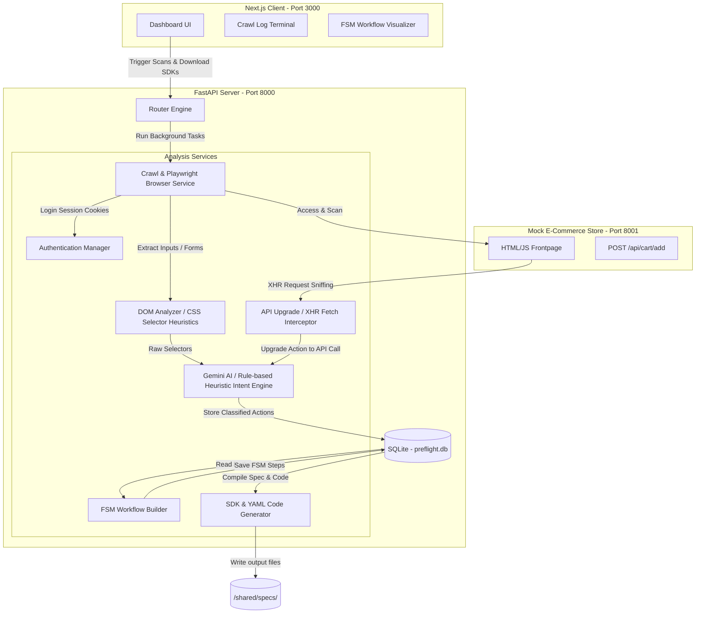

# 📐 Shiny Fishstick System Architecture

This document describes the technical architecture, data flow, and directory structure of the **Shiny Fishstick** specification compiler platform.

---

## 🏗️ High-Level System Architecture

Shiny Fishstick is structured as a decoupled three-tier system:
1. **Target Sandbox Sandbox / Website**: The target web platform being scanned (we provide a `/backend/mock_site` for verification).
2. **FastAPI Compiler Engine (Python)**: The core compiler containing the crawling, parsing, DOM analysis, semantic classification, API routing discovery, and SDK compilation pipelines.
3. **Next.js Dashboard (TypeScript)**: The visual frontend client displaying project status, crawl trace streams, action schemas, state machine graphs, and download links.



---

## 📂 Codebase Directory Layout

```
.
├── backend/
│   ├── app/
│   │   ├── core/
│   │   │   ├── config.py           # Application configurations (database paths, env variables)
│   │   │   └── database.py         # SQLAlchemy engine session context setup
│   │   ├── models/
│   │   │   └── db_models.py        # Database models (Projects, Crawls, Elements, Workflows)
│   │   ├── schemas/
│   │   │   └── pyd_models.py       # Pydantic serialization schemas for FastAPI requests/responses
│   │   ├── services/
│   │   │   ├── analyzer.py         # Heuristic DOM scraper compiling CSS selector scores
│   │   │   ├── api_disco.py        # Network interception engine upgrading action elements to API calls
│   │   │   ├── auth.py             # Automates login target detection and credential validation
│   │   │   ├── crawler.py          # Playwright crawling manager coordinating state flow
│   │   │   ├── generator.py        # YAML spec writer and Python/TS SDK compiler
│   │   │   ├── intent.py           # Semantic action classifier (Gemini AI + Rule Heuristics)
│   │   │   ├── updater.py          # Delta tracker detecting selector drift and updating SDKs
│   │   │   └── workflow.py         # Sequential path compiler translating actions into FSMs
│   │   └── main.py                 # FastAPI application router and background task workers
│   └── mock_site/
│       └── main.py                 # Mock E-Commerce target sandbox site for testing
├── frontend/
│   ├── src/app/
│   │   ├── layout.tsx              # Root HTML wrapper layout
│   │   └── page.tsx                # Next.js interactive dark-mode compiler dashboard
│   ├── package.json
│   └── tailwind.config.ts
├── shared/
│   └── specs/                      # Target compilation output folder
│       ├── preflight.yaml          # Navigation specification file (Swagger for browsers)
│       ├── sdk.py                  # Generated Python wrapper client class
│       ├── sdk.ts                  # Generated TypeScript wrapper client class
│       └── tools.json              # Function calling schema compatible with LLMs
└── test_pipeline.py                # Automated E-End verification script
```

---

## 🔬 Core Service Components Detail

### 1. The Crawler Service (`crawler.py`)
Responsible for scanning target platforms. It uses a **Breadth-First Search (BFS)** mechanism to crawl internal links.
- **Login Detection**: If the crawler lands on a page with input credentials, it immediately delegates to the `AuthService` to fill credentials, submit the form, and extract authorization cookies.
- **Route Normalization**: Aggregates duplicate dynamic routes (e.g. `/product/1` and `/product/99`) into normalized path templates (e.g. `/product/{id}`) to prevent crawl state explosion.

### 2. DOM Analysis Engine (`analyzer.py`)
Scans pages to generate target selectors. It scores element candidates based on their identifier attributes:
- `data-testid` (Weight: **1.0**)
- `id` (Weight: **0.9**)
- `name` (Weight: **0.7**)
- `class` (Weight: **0.4**)
- Tag/XPath (Weight: **0.1**)

### 3. Intent Engine (`intent.py`)
Applies semantic matching rules to group input inputs and click buttons into comprehensive Actions (e.g. binding an email input, password input, and submit button into a single `login(email, password)` method).
- Utilizes the **Gemini AI API** when available.
- Integrates a robust, regex-based **local heuristic classifier fallback** mapping semantic intents (like search, cart additions, login credentials, and checkout triggers) to maintain system stability offline.

### 4. API Upgrade Interception (`api_disco.py`)
Upgrades slow UI clicks into direct REST calls. It intercepts background `fetch`/`XHR` requests during interactive triggers (e.g. clicking `#add-to-cart-btn` calls `POST /api/cart/add`). The engine matches the request payload with the input values and converts the browser element selector into a high-speed HTTP request action.

### 5. SDK Generator Service (`generator.py`)
Reads discovered actions and compiles:
- `preflight.yaml`: The YAML Navigation Specification outlining route endpoints, action selectors, parameter schemas, and API definitions.
- `sdk.py` / `sdk.ts`: Fully functional Playwright wrapper clients featuring local cookie sessions, headless setups, and parameterized code methods.
- `tools.json`: A standard list of function tools to allow LLM agents to perform actions via function calling.
